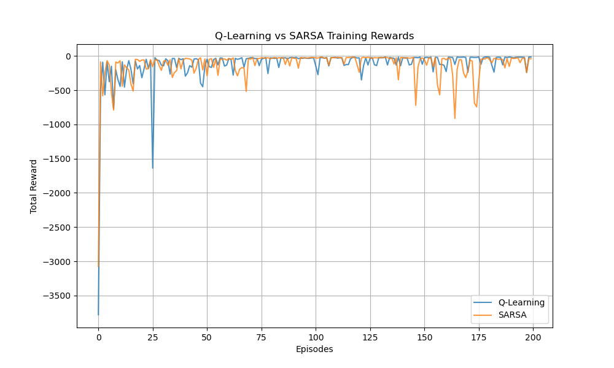

# 强化学习：Q-Learning 与 SARSA 在 Cliff Walk 问题中的比较

<center><div style='height:2mm;'></div><div style="font-family:华文楷体;font-size:14pt;">刘森元 21307289</div></center>
<center><span style="font-family:华文楷体;font-size:9pt;line-height:9mm">中山大学计算机学院</span>
</center>

## 问题描述

**Cliff Walk 问题**是强化学习中的一个经典环境，要求智能体在避免掉入悬崖的同时，尝试到达目标状态。环境设置如下：

- **网格大小**: $4 \times 12$
- **起始状态**: $(3, 0)$
- **目标状态**: $(3, 11)$
- **悬崖状态**: 从 $(3, 1)$ 到 $(3, 10)$ 的所有网格
- **动作**: `上`，`下`，`左`，`右`

### 奖励系统
- 移动到**非悬崖**单元格: 奖励 $-1$
- 掉入**悬崖**: 奖励 $-100$，并重置到起点。
- 到达**目标**: 奖励 $0$

---

## 算法概述

### Q-Learning
Q-Learning 是一种**基于最优策略**的离策略（off-policy）时间差分控制算法。它通过考虑**下一状态的最大奖励**来学习最优的动作价值函数，其更新公式为：

$$
Q(s, a) \leftarrow Q(s, a) + \alpha \left( r + \gamma \max_{a'} Q(s', a') - Q(s, a) \right)
$$

其中：
- $s, s'$：当前状态和下一状态
- $a, a'$：当前动作和下一动作
- $r$：奖励
- $\alpha$：学习率
- $\gamma$：折扣因子

### SARSA
SARSA 是一种**基于当前策略**的时间差分控制算法。它基于策略选择的实际动作来更新动作价值函数，其更新公式为：

$$
Q(s, a) \leftarrow Q(s, a) + \alpha \left( r + \gamma Q(s', a') - Q(s, a) \right)
$$

其中：
- 公式中 $a'$ 是基于当前策略实际选择的下一动作。

---

## 实验设置

- **超参数**:
  - 学习率 ($\alpha$): 0.1
  - 折扣因子 ($\gamma$): 0.9
  - 探索率 ($\epsilon$): 0.1
- **回合数**: 1000
- **性能衡量**:
  - **累计奖励**: 每个回合的总奖励。
  - **训练可视化**: 绘制奖励曲线，用于比较算法表现。

---

## 实现

### 环境设置与算法实现

```python
import numpy as np
import random
import matplotlib.pyplot as plt

ROWS, COLS = 4, 12
START = (3, 0)
GOAL = (3, 11)
CLIFF = [(3, i) for i in range(1, 11)]

ACTIONS = ['up', 'down', 'left', 'right']
actionToDelta = {'up': (-1, 0), 'down': (1, 0), 'left': (0, -1), 'right': (0, 1)}

alpha = 0.1
gamma = 0.9
epsilon = 0.1

def step(state, action):
    delta = actionToDelta[action]
    nextState = (state[0] + delta[0], state[1] + delta[1])
    nextState = (max(0, min(ROWS - 1, nextState[0])), max(0, min(COLS - 1, nextState[1])))
    if nextState in CLIFF:
        return START, -100
    elif nextState == GOAL:
        return nextState, 0
    else:
        return nextState, -1

def qLearning(episodes):
    qTable = { (i, j): {a: 0 for a in ACTIONS} for i in range(ROWS) for j in range(COLS) }
    rewards = []
    for _ in range(episodes):
        state = START
        totalReward = 0
        while state != GOAL:
            if random.random() < epsilon:
                action = random.choice(ACTIONS)
            else:
                action = max(qTable[state], key=qTable[state].get)
            nextState, reward = step(state, action)
            totalReward += reward
            maxQNext = max(qTable[nextState].values())
            qTable[state][action] += alpha * (reward + gamma * maxQNext - qTable[state][action])
            state = nextState
        rewards.append(totalReward)
    return qTable, rewards

def sarsa(episodes):
    qTable = { (i, j): {a: 0 for a in ACTIONS} for i in range(ROWS) for j in range(COLS) }
    rewards = []
    for _ in range(episodes):
        state = START
        totalReward = 0
        if random.random() < epsilon:
            action = random.choice(ACTIONS)
        else:
            action = max(qTable[state], key=qTable[state].get)
        while state != GOAL:
            nextState, reward = step(state, action)
            totalReward += reward
            if random.random() < epsilon:
                nextAction = random.choice(ACTIONS)
            else:
                nextAction = max(qTable[nextState], key=qTable[nextState].get)
            qTable[state][action] += alpha * (reward + gamma * qTable[nextState][nextAction] - qTable[state][action])
            state, action = nextState, nextAction
        rewards.append(totalReward)
    return qTable, rewards
```

## 实验结果
训练奖励曲线
下图展示了 Q-Learning 和 SARSA 算法在 200 回合中的累计奖励曲线：



观察
Q-Learning:

在累计奖励方面表现更优。
更倾向于冒险，因为它假设最优结果。
SARSA:

学习曲线更平稳，累计奖励略低。
避免高风险动作，更加保守。

## 结论
两种算法都能够成功学习到 Cliff Walk 问题的最优策略，但其行为有所不同：

Q-Learning: 偏向乐观，冒险性更高。
SARSA: 更为保守，风险较低。
实际应用中，选择哪种算法取决于环境特性和风险偏好。